# 🌾 KrishiMitra
## Har Kisan ka Digital Saathi

<div align="center">
  
  
  
  
  
</div>

<div align="center">
  <h3>🚀 Empowering farmers with AI-driven technology for smart agriculture</h3>
  <p><em>Bridging the gap between traditional farming and modern technology</em></p>
</div>

---

## 📋 Table of Contents

- [🌟 About KrishiMitra](#-about-krishimitra)
- [✨ Key Features](#-key-features)
- [🏗️ Architecture](#️-architecture)
- [📁 Project Structure](#-project-structure)
- [🚀 Quick Start](#-quick-start)
- [🔧 Detailed Setup](#-detailed-setup)
- [📡 API Documentation](#-api-documentation)
- [📱 Screenshots](#-screenshots)
- [🛠️ Tech Stack](#️-tech-stack)
- [🤝 Contributing](#-contributing)
- [👥 Team](#-team)
- [📄 License](#-license)

---

## 🌟 About KrishiMitra

KrishiMitra (meaning "Friend of Farmers" in Hindi) is a comprehensive full-stack platform designed to revolutionize agriculture through AI-powered technology. Our mission is to help farmers increase crop yield, reduce losses, and maximize profitability by providing them with cutting-edge tools and real-time insights.

### 🎯 Our Vision
To democratize access to agricultural technology and make smart farming accessible to every farmer, regardless of their technical background.

---

## ✨ Key Features

<table>
<tr>
<td width="50%">

### 🔐 **Secure Authentication**
- OTP-based mobile verification
- Secure user sessions
- Privacy-focused design

### 🌤️ **Weather Forecasting**
- Real-time weather data
- 7-day forecasts
- Farming-specific alerts

### 🔍 **Plant Disease Detection**
- AI-powered image analysis
- Instant disease identification
- Treatment recommendations

</td>
<td width="50%">


### 🤖 **AI Chatbot Assistant**
- 24/7 farming support
- Multilingual assistance
- Expert agricultural advice

### 📰 **Agricultural News**
- Market price updates
- Industry trends
- Government policy changes

</td>
</tr>
</table>

### 🎥 **Additional Features**
- **🏛️ Government Schemes:** Information about current state & central government agricultural schemes
- **📚 Educational Videos:** Agriculture-related YouTube videos in Hindi
- **📊 Dashboard:** Comprehensive overview of all farming activities
- **👤 Profile Management:** Personalized user experience

---

## 🏗️ Architecture

```mermaid
graph TB
    A[👤 User] --> B[📱 React Frontend]
    B --> C[🔐 Node.js Login Service]
    B --> D[🖥️ Django Backend]
    C --> E[📧 Twilio SMS]
    D --> F[🤖 AI Models]
    D --> G[📊 Database]
    D --> H[🌐 External APIs]
    F --> I[🔍 Disease Detection]
    F --> J[💬 Chatbot]
    H --> K[🌤️ Weather API]
    H --> L[📰 News API]
```



---

## 📁 Project Structure

```
📦 KrishiMitra/
├── 🖥️ krishimitrabackend/          # Django REST API Backend
│   ├── 🔧 manage.py
│   ├── ⚙️ requirements.txt
│   ├── 🏗️ krishimitra/
│   ├── 👤 users/
│   ├── 🌱 crops/
│   ├── 🔍 disease_detection/
│   └── 🤖 ai_models/
│
├── 📱 krishimitrafrontend/          # React + Vite Frontend
│   ├── 📦 package.json
│   ├── ⚡ vite.config.js
│   ├── 📄 index.html
│   └── 📂 src/
│       ├── 🧩 components/
│       ├── 📄 pages/
│       ├── 🎨 assets/
│       └── 🔧 utils/
│
├── 🔐 krishimitraloginnode/         # Node.js OTP Service
│   ├── 📦 package.json
│   ├── 🖥️ server.js
│   ├── 🔧 .env.example
│   └── 📂 routes/
│
└── 📚 docs/                        # Documentation
    ├── 📖 README.md
```

---

## 🚀 Quick Start

### Prerequisites
- 🐍 Python 3.8+
- 📦 Node.js 18+
- 🗄️ DBSQLite
- 📱 Twilio Account (for SMS)

### ⚡ One-Click Setup
```bash
# Clone the repository
git clone https://github.com/R0hit-Yadav/HackovateLJ_2025.git
cd krishimitrabackend

# Run setup script (Coming Soon!)
./setup.sh
```

---

## 🔧 Detailed Setup

### 1️⃣ Backend Setup (Django)

```bash
cd krishimitrabackend

# Create virtual environment
python -m venv venv
source venv/bin/activate  # On Windows: venv\Scripts\activate

# Install dependencies
pip install -r requirements.txt

# Environment configuration
cp .env.example .env
# Edit .env with your database and API keys

# Database setup
python manage.py makemigrations
python manage.py migrate
python manage.py createsuperuser

# Start the server
python manage.py runserver
```

**🔗 Backend will be running on:** `http://localhost:8000`

### 2️⃣ Frontend Setup (React + Vite)

```bash
cd krishimitrafrontend

# Install dependencies
npm install

# Environment configuration
cp .env.example .env
# Edit .env with your API endpoints

# Start development server
npm run dev
```

**🔗 Frontend will be running on:** `http://localhost:5173`

### 3️⃣ Login Microservice Setup (Node.js)

```bash
cd krishimitraloginnode

# Install dependencies
npm install

# Environment configuration
cp .env.example .env
# Add your Twilio credentials:
# TWILIO_ACCOUNT_SID=your_account_sid
# TWILIO_AUTH_TOKEN=your_auth_token
# TWILIO_PHONE_NUMBER=your_twilio_number

# Start the service
npm start
```

**🔗 Login service will be running on:** `http://localhost:3000`

---

## 📡 API Documentation

### 🔐 Authentication Endpoints
| Method | Endpoint | Description |
|--------|----------|-------------|
| `POST` | `/send-sms` | Send OTP to mobile number |
| `POST` | `/verify-otp` | Verify OTP and login |

### 🌱 Agriculture Endpoints
| Method | Endpoint | Description |
|--------|----------|-------------|
| `GET` | `/api/crops/` | Get all crops information |
| `POST` | `/api/disease-detect/` | Upload image for disease detection |
| `GET` | `/api/weather/{location}` | Get weather forecast |
| `GET` | `/api/news/` | Get agricultural news |
| `POST` | `/api/chat/` | Chat with AI assistant |

### 📊 Response Format
```json
{
  "success": true,
  "data": {
    // Response data here
  },
  "message": "Success message",
  "timestamp": "2025-09-14T10:30:00Z"
}
```


---

## 🛠️ Tech Stack


<div align="center">

### Frontend


### Backend


### Microservices


### Database & Tools


</div>

## 📈 Roadmap

- [ ] 📱 Mobile App (React Native)
- [ ] 🌐 Multi-language Support
- [ ] 📊 Advanced Analytics Dashboard
- [ ] 🤖 Machine Learning Model Improvements
- [ ] 📞 Voice Assistant Integration


## 👥 Team

<div align="center">

| 👨‍💻 **Rohit Yadav** | 👨‍💻 **Parth Patel** | 👨‍💻 **Ganpat Kumawat** |
|:---:|:---:|:---:|
| AI/ML Enginner | Integration Specialist | Frontend Engineer |
| []([https://github.com/rohityadav](https://github.com/R0hit-Yadav)) | []([https://github.com/parthpatel](https://github.com/EndlessRunner72)) | []([https://github.com/ganpatkumawat](https://github.com/Ganpat-8903)) |

### 🎯 **Team Sudarshan**
*Passionate about solving real-world problems through technology*

</div>


## 📄 License

This project is created for **educational and demonstration purposes** as part of HackovateLJ 2025. 

```
MIT License - Feel free to use this project for learning and development.
Commercial use requires permission from the team.
```

---

## 📞 Support

<div align="center">

**Need Help? We're here for you!**

[](mailto:krishimitra@gmail.com)
[](https://discord.gg/krishimitra)
[](https://docs.krishimitra.com)

</div>

*Last updated: September 14, 2025*
